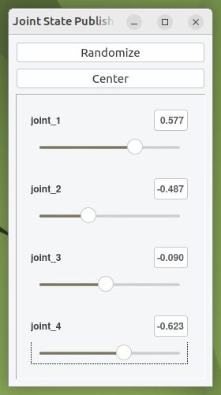
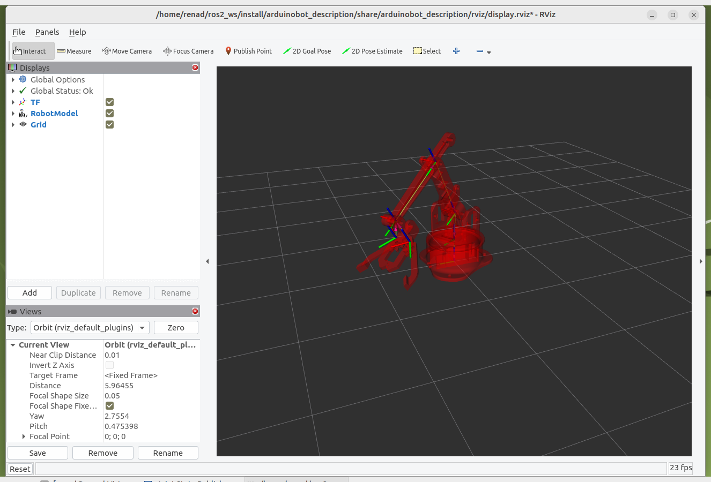
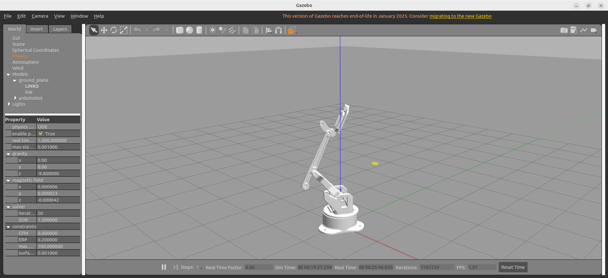
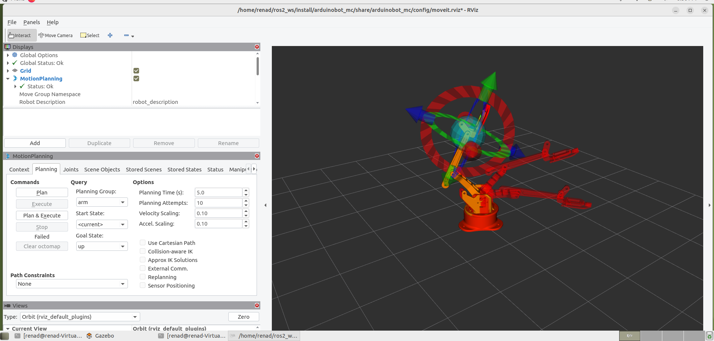

## 🤖Robot Arm Control with Joint State Publisher GUI and MoveIt + Gazebo (ROS 2)

This project demonstrates a simulated robot arm built with ROS 2 Humble. It includes two main parts:

🧩 1. **Joint State Publisher GUI** – for direct manual control of the robot joints.  
🤖 2. **MoveIt + Gazebo Integration** – for motion planning and simulation in a virtual world.

Developed as a training project for robotics simulation and control without hardware.

---

## 🧩 1. Joint State Publisher GUI

This part allows you to visualize the robot arm in RViz2 and control its joints manually using a graphical interface.

### ✅ Prerequisites

- ROS 2 Humble
- RViz2
- Joint State Publisher GUI

### 🔨 Build Instructions

```bash
cd ~/ros2_ws
colcon build
source install/setup.bash
```

### 🚀 Launch the Arm Model with GUI

```bash
ros2 launch arduinobot_description display.launch.py
```

This command launches RViz2 with the robot model and opens a GUI to manually change joint angles.

### 📸 Screenshots

| Joint GUI | RViz2 |
|----------|-------|
|  |  |

---

## 🤖 2. MoveIt + Gazebo Integration

This part integrates MoveIt 2 for motion planning and Gazebo for realistic physics simulation.

### ✅ Prerequisites

- MoveIt 2 (for ROS 2 Humble)
- Gazebo
- RViz2

### 🔨 Build Instructions

```bash
cd ~/ros2_ws
colcon build
source install/setup.bash
```

### 🧪 Step 1: Launch Gazebo Simulation

Open a terminal and run:

```bash
ros2 launch arduinobot_description simulation.launch.py
```

> This opens a Gazebo world with the robot inside.

### 🧠 Step 2: Launch MoveIt for Motion Planning

In a second terminal:

```bash
ros2 launch arduinobot_controller demo.launch.py
```

> This opens RViz2 with the MoveIt interface to plan and execute trajectories.

### 📸 Screenshots

| Gazebo | MoveIt in RViz |
|--------|----------------|
|  |  |

---


